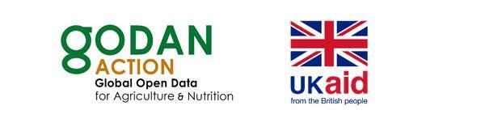

# GODAN Action Open Data Management in Agriculture and Nutrition Course

The GODAN Action network developed a free MOOC \(Massive Open Online Course\) on Open Data Data Management in Agriculture and Nutrition. The course was delivered five times from November 2017 to November 2018. 

This e-learning course is the result of a collaboration between GODAN Action partners, including [Wageningen Environmental Research](https://www.godan.info/pages/action), [AgroKnow](https://www.agroknow.com), [AidData](https://www.aiddata.org), [the Food and Agriculture Organization of the United Nations \(FAO\)](http://www.fao.org/home/en/), [the Global Forum on Agricultural Research \(GFAR\)](https://www.gfar.net), [the Institute of Development Studies \(IDS\)](https://www.ids.ac.uk), [the Land Portal](https://landportal.org), [the Open Data Institute \(ODI\)](https://theodi.org) and [the Technical Centre for Agriculture and Rural Cooperation \(CTA\)](https://www.cta.int/en).



The course was designed to reach and train a higher number of participants, from a wide range of countries, who can use the online resources to study at a time and location convenient for them.

It aims to strengthen the capacity of data producers and data consumers to manage and use open data in agriculture and nutrition. One of the main learning objectives is for the course to be used widely within agricultural and nutrition knowledge networks, in different institutions. The course also aims to raise awareness of different types of data formats and uses, and to highlight how important it is for data to be reliable, accessible and transparent.

> GODAN Action is a three-year project UK’s Department for International Development to enable data users, producers and intermediaries to engage effectively with open data and maximise its potential for impact in the agriculture and nutrition sectors. In particular we work to strengthen capacity, to promote common standards and best practice and to improve how we measure impact. \[www.godan.info\]

