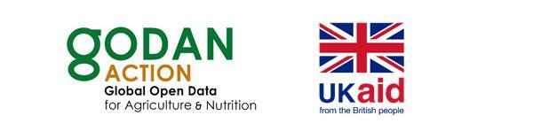

# Read about the course

## Course objective

This course aims to strengthen the capacity of data producers and data consumers to manage and use open data in agriculture, nutrition and land. You may want to check detailed curriculum of the course on the GODAN Action web page. 

Attending the course enables you to;

* Understand the principles and benefits of open data 
* Understand ethics and responsible use of data Identify the steps to advocate for open data policies 
* Understand how and where to find open data 
* Apply techniques to data analysis and visualisation 
* Recognise the necessary steps to set up an open data repository
* Define the FAIR data principles 
* Understand the basics of copyright and database rights 
* Apply open licenses to data

## Target Audience

The course content is designed to infomediaries which includes ICT workers, technologist - journalists, communication officers, librarians and extensionists; policy makers, administrators and project managers, and researchers, academics and scientists working in the area of agriculture, nutrition, weather and climate, and land data.

## Course structure

The course is provided in English. It consists of five units as follows including 18 lessons. The content was developed in November 2017 and last edition was delivered in 2018.

* Unit 1: Open Data Principles
* Unit 2: Using Open Data
* Unit 3: Making Data Open
* Unit 4: Sharing Open Data
* Unit 5: Intellectual Property and Copyright

You can find the [full published curriculum by clicking ](https://www.godan.info/documents/curriculum-open-data-and-research-data-management-agriculture-and-nutrition)[here](http://www.godan.infohttp//assets.aims.fao.org.s3-eu-west-1.amazonaws.com/public/documents/Curriculum_final.pdf). 

## Certification

GODAN Action Team run this course on an irregular base with a customised content for different target audiences. The course is delivered by the GODAN Action project partners \(e.g. from CTA, FAO, the ODI, Land Portal\) with support from subject experts. 

The course is modular, therefore it is suitable to be mixed and matched for different purposes. Participants are offered online tutorials, forum discussions, assignments and individual support from the subject experts during the course.  

In a course delivery, participants are given short quizzes, assignments and more practical activities within the units. The course ends with a course exam and course evaluation survey. Online Certificate of Attendance is provided for those who actively participated in the course. For the eligibility for the certificate, it is recommended to read particular course details as it varies among different versions of the course. 

Currenty, the course is not being delivered and the content is fully available on this platform. If you have any question, please email us at godanaction@godan.info. 

## Licensing

This work is licensed under a [Creative Commons BY-SA License](https://creativecommons.org/licenses/by-sa/2.0/). You do not have to ask our permission to re-use this MOOC content. You must give appropriate credit, provide a link to the license, and indicate if changes were made. If you remix, transform, or build upon the material, you must distribute your contributions under the same license as the original.

## Acknowledgement of the contributors

As mentioned in the introduction, this e-learning course is the result of a collaboration between GODAN Action partners, including [Wageningen Environmental Research](https://www.godan.info/pages/action) \(WUR\), [AgroKnow](https://www.agroknow.com), [AidData](https://www.aiddata.org), t[he Food and Agriculture Organization of the United Nations \(FAO\)](http://www.fao.org/home/en/), [the Global Forum on Agricultural Research \(GFAR\)](https://www.gfar.net), and [the Institute of Development Studies \(IDS\)](https://www.ids.ac.uk), [the Land Portal](https://landportal.org), [the Open Data Institute \(ODI\)](https://theodi.org) and [the Technical Centre for Agriculture and Rural Cooperation \(CTA\)](https://www.cta.int/en). The authors involved in developing the course content are \(in alphabetical order by name\);

* Alan Stanley, IDS
* Hugo Besemer, retired from WUR
* Chipo Msengezi, CTA
* Chris Addison, CTA
* David Tarrant, ODI
* Ilkay Holt, FAO
* Imma Subirats, FAO
* Jessica Meeker, IDS
* Laura Meggiolaro, Land Portal
* Lisette Mey, Land Portal
* Pauline L'Henaff, ODI
* Valeria Pesce, FAO
* Rob Lokers, WUR

## How to cite this course? 

AIMS. \(2019, December 20\). GODAN Action Open Data Management in Agriculture and Nutrition Course \(Version v1.0\). Zenodo. [http://doi.org/10.5281/zenodo.3588148](http://doi.org/10.5281/zenodo.3588148)

## Contact information

For your questions and inquires, please contact us at [godanaction@godan.info](mailto:godanaction@godan.info). Project website is accessible at [https://www.godan.info/pages/action](https://www.godan.info/pages/action). 

