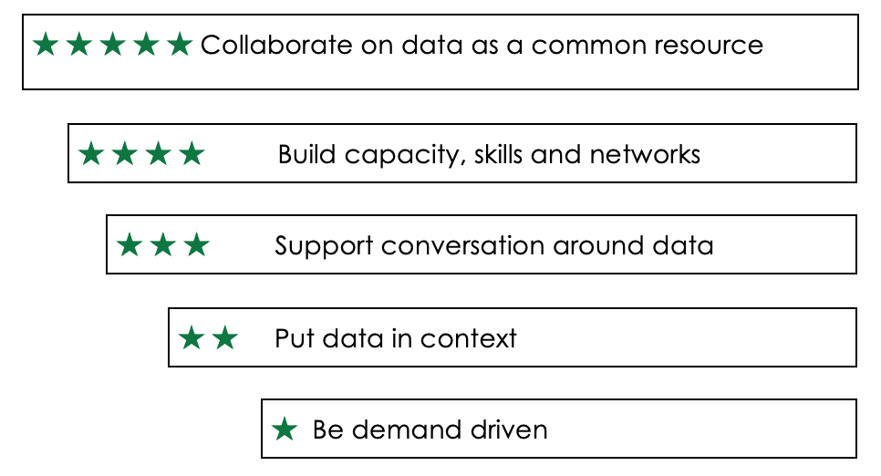

# Lesson 3.4: Advocate for capacity development on open data

## Aims and learning outcomes

This lesson aims to describe the steps needed to for promoting the open data repositories by engaging reusers. It also gives the importance of capacity development for of open data and the skill that need to be developed. Finally, the lesson will share best practices to capture lessons from open data initiatives for continual improvement of open data initiatives.

After studying this lesson, you should be able to:

* understand the importance of promoting your own repository
* package, deliver and disseminate the information for advocacy purposes
* understand the capacity development needs for open data
* communicate value and impact of open data with their audience collect and prepare lessons learnt and good practices

## 1. Introduction

As discussed in earlier lessons, open data offers a substantial economic and societal potential. This can be achieved by creating an enabling environment where the data is accessible, reusable and actually reused by people and organisations who transform it into value. In order to realise the full potential of open data in agriculture, it is therefore necessary to ensure that your open data initiatives and repositories are adequately promoted and marketed.

## 2. Promoting open data initiatives

You can make your open data initiative a larger success if you engage the reusers. Going beyond the approach of simply publishing data online, Tim Berners-Lee has developed a five-star [open data engagement model](http://www.opendataimpacts.net/engagement/). The model developed explores how to**:**

* be demand driven
* put data in context
* support conversation around data
* build capacity, skills and networks
* collaborate on data as a common resource.

[Tim Berners-Lee’s five stars](http://5stardata.info/en/) of linked open data set out a series of approaches that open data initiatives, big and small, can take to publish data on the web. The Five-star Open Data Engagement Model seeks to add to this, highlighting key steps that open data initiatives can take to engage with data users. Each star includes a set of questions to unpack what might be involved in taking that step towards engagement.

★ **Be demand driven**

* Are your choices about the data you release, how it is structured, and the tools and support provided around it based on community needs and demands?
* Have you got ways of listening to people’s requests for data, and responding with open data?

★ ★ **Put data in context**

* Do you provide clear information to describe that data you provide, including information about frequency of updates, data formats and data quality?
* Do you include qualitative information alongside datasets such as details of how the data was created, or manuals for working with the data?
* Do you link from data catalogue pages to analysis of the data that your organisation, or third-parties, have already carried out with it, or to third-party tools for working with the data?

★ ★ ★ **Support conversation around data**

* Can people comment on datasets, or create a structured conversation around data to network with other data users?
* Do you join the conversations?
* Are there easy ways to contact the individual ‘data owner’ in your organisation to ask them questions about the data, or to get them to join the conversation?
* Are there offline opportunities to have conversations that involve your data?

★ ★ ★ ★ **Build capacity, skills and networks**

* Do you provide or link to tools for people to work with your datasets?
* Do you provide or link to ‘How To’ guidance on using open data analysis tools, so people can build their capacity and skills to interpret and use data in the ways they want to?
* Do you go out into the community to run skill-building sessions on using data in particular ways, or using particular datasets?
* Do you sponsor or engage with capacity building to help the community work with open data?

★ ★ ★ ★ ★ **Collaborate on data as a common resource**

* Do you have feedback loops so people can help you improve your datasets?
* Do you collaborate with the community to create new data resources \(e.g. derived datasets\)?
* Do you broker or provide support to people to build and sustain useful tools and services that work with your data?
* Do you work with other organisations to connect up your data sources?

### 2.1.          Communicate the value and impact of open data

There is need for communicating value and impact of open data. To do this, you need to gain insight into the economic and societal value and experiences of the [using the open data](https://www.europeandataportal.eu/sites/default/files/re-using_open_data.pdf) at an organisational level. What are the experiences people have when accessing or reusing the data? What barriers are they facing? How much value do they generate from the reuse of the open data? This can be done for example, through the use of online surveys and in-depth interviews.

Below is a three-pillar approach that has been used by the European Commission in a study on ‘Reusing Open Data’ used to understand how organisations, primarily within the private sector, use open data and what business models have been developed around its reuse.

### 2.2.          Support

Note that engagement with reusers is a two-way street, and you should provide methods for reusers to get back in touch with you. You should also try to enable reusers to help each other.

The support you provide should [include](https://theodi.org/guides/engaging-reusers):

* a **data contact** for questions reusers might have about the data or issues that they're having using it, including bugs that arise in your provision
* a **forum** where you recommend reusers pose questions of other reusers, so that they can help each other; this doesn't have to be a site that you manage – one option is to point reusers to [Get the Data](http://getthedata.org) as the forum of choice
* a contact route for **error reports** to enable reusers to provide corrections for problems they spot within the data; the information you provide should set expectations about how those reports will be dealt with, and you should indicate how existing reusers are informed of these corrections
* if your data contains or is derived from personal information, you should have a contact point for any **confidentiality concerns** that reusers have.

### 2.3.          Services

The Open Data Institute recommends that if your data is important and complex, it will help reusers if you can provide tools, such as plugins, visualisations, software libraries and services that enable reusers to build on others' work with the data. These tools are sometimes built by third parties.

### 2.4.          Active outreach

Understanding and tracking reuse of your data can help you to plan improvements and to make the case for further data releases. You should consider:

* maintaining an active presence on **social media**
* using **search engine alerts** to find out when your data is mentioned
* **blogging** to showcase good examples of use of your data
* arranging **hackdays or competitions** to encourage the use of your data

Whilst not worthwhile for all datasets, in some cases explicit community building, engagement and outreach work can help to maximise the value that your data brings to your organisation and to others.

### 2.5.          Developing a plan for promotional activities – an example

As a data provider, you can be a catalyst for the use of open data by creating a thriving ecosystem of data users, coders, and application developers. To attract an ecosystem of developers, you can plan promotional activities through various means. You need to ensure you understand the audience you are targeting and that you have a **value proposition**. A value proposition is a marketing statement that you can use to summarise why a user should use your open data repository. This statement convinces data consumers, infomediaries, journalists, etc., that your data and services add more value or better solve a problem that they are facing.

**Set a goal of what you want to achieve:** e.g., to get more local agribusinesses actively using data from the Ministry of Agriculture open data repository.

**Target audience:** Small and Medium Agribusiness Enterprises \(SMEs\) in Country

**Proposition:** Using free government agricultural open data can save your business valuable time and money.

**Objectives:**

* _Knowledge objective_: to increase the number of agribusiness SME owners in that have heard of open data by 25% over benchmark by the end of the fiscal year
* _Belief objective_: to have 50% of SME owners \(who are aware of open data by the end of the fiscal year\) believe that using government open data can help them save time and money
* _Behaviour objective_: 5% of all SME agribusiness owners \(or people on their behalf\) download and use datasets from data.xx.xx.

**Promotion:** This can be a mix of advertising and public relations activities, e.g., face-to-face presentations on how open data can help entrepreneurs, free seminars, demonstrations, testimonials from other agribusiness SMEs using datasets. You can organise hackathons often with prize money and publicity.

Ask yourself:

* How can you send marketing messages to your potential users?
* When is the best time to promote the repository?
* Is it best to use the social media in promoting your repository?
* What is the promotion strategy of other open data initiatives in other countries?

## 3. Capacity development for open data

To work with open data, certain e-skills are needed. These skills consist of both hard and soft skills. According the studies by the European Commission, there is a big skills gap between the demand for skilled data workers and their supply. Table 1 gives a description of the various e-skills that are needed to be able to work with open data.

Table 1 [E-skills and Open Data](https://www.europeandataportal.eu/sites/default/files/edp_analytical_report_n2_-_e-skills.pdf)

**Technical \(hard\) skills**

A variety of technical skills is necessary to be able to make the most use of data, according to the data value chain \(see Figure 3\). These include: analytical skills to formulate the problem first and to think of the best approach to solve it using data; mathematical and statistical skills; data visualisation skills; application design and development.

**Soft skills**

Soft skills are often overlooked when thinking about open data and data analytics in general. Creativity and curiosity are needed to define a working hypothesis and to measure the possibilities offered by a given dataset. Indeed, to start processing the data, one has to have an idea what to do with the data. What types of insight can one gain? Which insights can possibly be created? This requires soft skills. Soft skills are also important to allow for greater collaboration with the business side of the organisation – in other words with the decision makers.  Managers are expecting to apply the insights gathered by data analysis into their daily operations and in order to do this so, the employees analysing the data need to be able to communicate their findings in an understandable way. Data workers need to invest in their communication skills if they want to make an impact in their organisations.

In an effort to build the skill base of citizens the European Commission set up a structure called [The European Data Science Academy \(EDSA\) ](http://edsa-project.eu/)that develops learning materials that are built on an ongoing analysis of industry requirements with respect to skilled data scientists and data workers.  The EDSA designs curricula for data science training and data science education across the European Union \(EU\). They established a virtuous learning production cycle whereby they: \(1\) analyse the required sector specific skillsets for data scientists across the main industrial sectors in Europe; \(2\) develop modular and adaptable data science curricula to meet industry expectations; and \(3\) deliver data science training supported by multi-platform and multilingual learning resources. The curricula and learning resources are continuously evaluated by pedagogical and data science experts during both development and deployment.

It is also worthwhile to identify projects such as GODAN Action which are working to strengthen capacity, to promote common standards and best practice and to improve how impact is measured. The resources and training material from projects like these can be accessed and adapted for local training needs, for example.

Organisations therefore need to consider short-, mid- and long-term strategies to avoid falling behind and to stay competitive using data. A short- to mid-term strategy is to invest in training for staff in data science and management, in addition to recruiting qualified personnel. A long-term strategy would be to build strong partnerships with communities who are working to develop capacities for open data so as to build a solid pipeline of technical talent.

## 4. Learning, sharing and improving from experience

It is important for data providers to ensure that experiences and lessons from their open data initiative are captured, learned from and can be adapted, improved, adopted by others and scaled up, leading to a greater organisational visibility, credibility and impact of open data. There are many stages to making data open, and at each stage there are lessons to be learnt.

Consider the various different experiences involved during the implementation of an open data initiative: developing an open data strategy, drafting an open data policy, selecting open data software platforms, collecting and preparing the data, publishing and maintaining open data, monitoring and engaging users of the open data. A process that can help with this process of learning is called Experience Capitalisation.

**Experience Capitalisation** is a systematic, interactive and participatory process through which an experience is analysed and documented leading to creation of knowledge \(for example good practices or lessons learned\) \([CTA](http://experience-capitalization.cta.int/gathering-and-organizing-information/), 2018\), which can be shared and used to improve the open data ecosystem. The process allows you to look back at what you have done in the past, in order to do better in the future. As you critically analyse your experience you will find that you learn from both success and failures. Discussing the benefits of the process and your organisation’s knowledge and information needs can be the best way to convince your colleagues that it is worth spending time and energy on an experience capitalisation process for the overall success of the open data initiative.

**The Process**

An experience capitalisation process is a participatory initiative, involving a wide range of people with different responsibilities. Firstly, you need to understand **what you are doing, why and for whom.**

You may start from each of the points:

* having a clear **objective** that drives the selection of particular experience, e.g. validation of the open data strategy;
* sometimes you may have a clear **audience** in mind, e.g. practitioners, community members or a donor.

As you consider which experience to capitalise upon, remember also to consider failures! Implementation rarely goes exactly according to plan:

* mistakes are made both in the design and execution of interventions;
* conditions change and the unexpected happens.

Secondly identify **who should join the process** ensuring that all participants participate effectively throughout.  The group of people joining an experience capitalisation process needs to be representative of those who were \(or are\) part of the open data initiative you are implementing and promoting.

Next, you need to tell the story of what actually happened ‘on the ground’. In order to do this, it is first necessary to **collect enough information from a wide diversity of sources**. Most of the information will come from the team directly involved in opening up the data but you should also look for other sources of information. This can come from your community of data users, field staff, partner organisations, reports or work plans. The best way to collect information is to use different tools, such as interviews, group discussions, and surveys. When you do this, you are better able to identify missing information, and prioritise, filter and organise what you know, according to its relevance.

Thereafter comes **the analysis phase**, which is the most important part of the capitalisation process. It is very much related to an evaluation, which many people are familiar with. An analysis aims to discover the reasons behind these results. For this the team needs to adopt a critical perspective, taking a step back, putting the experience in perspective and questioning it or even challenging it. First, how did we carry out this activity? Then, why was this activity successful? Or not?

Analysis can happen both with and without facilitation. What is most important is that there is an explicit opportunity to share lessons. There are a variety of facilitation methods that are appropriate for the different steps of the capitalisation process. These include methods such as World Café, ORID, Share Fairs and storytelling, as well as writeshops and exchange visits \([FAO, 2016](http://www.fao.org/elearning/Course/EXCAP/en/Lessons/Lesson1464/Resources/1464_lesson_text_version.pdf)\). A matrix describes which method to use to capture and share lessons can be found online \([FAO, n.d.](http://www.fao.org/elearning/Course/EXCAP/en/Lessons/Lesson1464/Resources/1464_Job%20aid_Lesson%202.2-P18-%20Facilitation%20Methods%20Matrix_fnl.pdf)\).

One of the main objectives of a capitalisation process is to **share the lessons or knowledge generated**. These lessons can be presented in different formats \(written, oral, audio-visual and/or electronic, etc.\) according to the target audience and to the specific objectives. Yet, whatever the final choice, it will be necessary to first capture the results of a capitalisation process in writing. A written document can help you store your ideas and also reach out to many people. It may take different shapes, but in all cases, it needs to be concise, attractive or rigorous if it to be effective.

Finally, incorporating the lessons learnt into your existing work plans or activities, can be seen as a stepwise process towards further success, adoption and scaling up of open data initiatives. 

More on the full Experience Capitalisation projects can be found at: [http://experience-capitalization.cta.int](http://experience-capitalization.cta.int).

## Summary

You can make your open data initiative a larger success if you engage the reusers. Going beyond the approach of simply publishing data online, consider the following strategies to increase usage of your open data:

* be demand driven
* put data in context
* support conversation around data
* build capacity, skills and networks
* collaboration on data as a common resource.

To be able to effectively work with open data, capacities need to be developed for specific e-skills, consisting of both hard and soft skills. Organisations therefore need to consider short-, mid- and long-term strategies to build capacity and to stay competitive using data. A short- to mid-term strategy is to invest in training for staff in data science and management in addition to recruiting qualified personnel. A long-term strategy would be to build strong partnerships with communities who are working to develop capacities for open data so as to build a solid pipeline of technical talent.

It is important for data providers to reflect on their experiences of implementing an open data project. This allows for the capturing of important information about the process which can be learned from and can be adapted, improved, adopted by others and scaled up, leading to a greater organisational visibility, credibility and impact of open data.

This can be facilitated through an Experience Capitalisation process. Lessons learned as a result of a project are often not shared within an organisation, let alone with other organisations, because projects often dedicate too little time to reflect upon their work to draw lessons and to share them.

One of the main objectives of a capitalisation process is to share the lessons or knowledge generated towards further success, adoption and scaling up of open data initiatives. 

