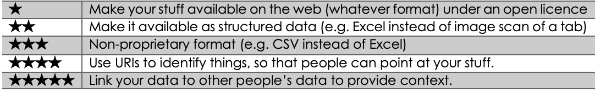

# Lesson 4.1: Guiding frameworks for data sharing

## Aims and learning outcomes

**This lesson aims to**:

* introduce the most endorsed guiding frameworks for data sharing \(FAIR, TBL’s 5 stars, Linked Open Data, W3C Best Practices\)
* match the principles and indications from such frameworks with practical guidelines on how to implement them.

**After studying this lesson, you should be able to:**

* _understand the principles of the most important guiding frameworks for sharing open data_
* _understand the major practical implications of these frameworks_
* _evaluate different ways of publishing data, including tools, against these frameworks_
* identify sustainability issues in an open data policy, and be aware of how to overcome of these issues.

## 1. Guiding frameworks for data: From open to FAIR

Data sharing is something that has always happened, especially among researchers, in different ways over the centuries. In agriculture as in other areas, data exchange is much needed for research and innovation but also for business \(e.g. market prices, infrastructure, weather information\) as well as for policy and regulations \(e.g. tracking of food products and use of pesticides\). So the stakeholders involved are varied and their interests are sometimes aligned and sometimes not, but in the end they all need data from other actors or from other parts of the data value chain.

A key factor that has changed the game of data sharing in the last decades is of course the advent of the internet and more recently the cloud and big-data technologies that have multiplied the potential of data processing power. At the beginning of the web its inventor Tim Berners-Lee saw it as a ‘web of data’ and over the last decade everybody has come to acknowledge that the primary consumers of data and the actual intermediaries in the data sharing process are machines and therefore, in order to be shared, data must be machine-readable.

On the other hand, the ease of sharing data on the web brings with it legal concerns about the use that can be made of those data: the fact that they are on the web only means that they can be read, but nothing is said about permission to reuse, modify or re-distribute. If permissions are not made explicit, data cannot legally be reused.

Sharing data therefore requires **agreements on how data should be ‘written’ for machines** \(because machines have to be programmed to read it and have to know the rules\), but also **on how data can be used** – if they can be modified, if they can be redistributed etc. – in short, usage rights and how to formalise these as well \(more on the issue of licensing data can be found in unit 5\). Agreeing on this can be just a matter of ad hoc agreements or technical specifications, or, with a more ambitious and long-term view, it can lead to the creation of **general authoritative guiding frameworks** that become widely endorsed. In this lesson we will introduce the two major frameworks that have been set out and endorsed for sharing data.

### 1.1.         Tim Berners-Lee’s 5 star deployment scheme for open data

The first guiding framework for sharing data was designed by the inventor of the web himself, Sir Tim Berners-Lee. The technical framework he designed for the web of data is the ‘Linked Open Data’ \([LOD](http://linkeddata.org)\) or simply [Linked Data](https://www.w3.org/wiki/LinkedData) good practice, which was fully formalised in 2006; it consists of very technical guidelines to make data fully linked and it basically recommends:

* use URIs as names for things
* use HTTP URIs so that people can look them up
* when someone looks up a URI, provide useful information; and
* include links to other URIs, so that they can discover more things.

However, given the high entry barrier to such technological solutions, around 2010 he published the more comprehensive **5 star open data deployment scheme**, ‘in order to encourage people -- especially government data owners -- along the road to good [linked data](https://www.w3.org/DesignIssues/LinkedData.html)’.  The 5 star scheme illustrates the ‘continuum’ in data publishing that leads to the final steps of fully linked open data \(the LOD framework is only a subset of it, the last two stars\).

TBL’s 5 stars are still a reference framework for everybody working on open data. They have been normally interpreted as ‘cumulative’, in that ‘[each additional star presumes the data meets the criteria of the previous step\(s\)](https://www.w3.org/2011/gld/wiki/5_Star_Linked_Data)’, which has always put enormous weight on the first step, an **open licence**, as sort of a requirement in the absence of which even implementing the other four stars would not bring you to really open data. All the other stars relate to the interoperability of data \(we will see this better in unit 2 and in lessons 4.2 and 4.3, together with the closely associated Linked Open Data framework\), while the first star is all about openness for reuse. TBL’s 5 stars are really a framework for openness and hence they are also called ‘**the 5 stars of openness**’.

\[To be more precise, to distinguish between Linked Data and Linked Open Data, [TBL said](https://www.w3.org/DesignIssues/LinkedData.html): ‘Linked Data does not of course in general have to be open -- there is a lot of important use of linked data internally, and for personal and group-wide data. You can have 5-star Linked Data without it being open. However, if it claims to be Linked Open Data then it does have to be open to get any star at all.’\]

The concept of ‘open’ has been the cornerstone of all initiatives on knowledge and data sharing for decades. The official definition of ‘[open data](http://opendatahandbook.org/guide/en/what-is-open-data/)’ is that it is data that can be freely used, reused \(modified\) and redistributed \(shared\) by anyone. It is a general concept that applies to any type of resource \(document, image, dataset\), it has a few rules and is fairly easy to apply.

However, in recent years some of the predicaments of this framework have been seen as potentially discouraging the sharing of data, especially in the context of data-intensive research and data transmitted across the various steps of the data value chain, because they are very strict:

* The **definition of ‘open licence’** is very strict: in their basic course on open data the [Open Data Institute \(ODI\) says](http://training.theodi.org/InADay/#/id/co-01) that ‘this licence must permit people to use the data in any way they want, including transforming, combining and sharing it with others, even commercially’. The requirement of an open licence could prevent sharing of data that has some access restrictions but can still be reused in large communities or through simple agreements and can therefore still have a big impact.
* The fourth and fifth stars, especially in versions that describe each star further, are sometimes seen as too much tied to the Resource Description Framework \(RDF\) technical approach \(see the next sections and lesson 4.2\), instead of being generic principles that can be implemented with any technology.

This does not mean that this framework has been superseded: it is still the reference framework for high interoperability of data and for a loosely coupled, bottom-up open web of data.

### 1.2.         The FAIR principles

Recently, since the reuse of data is unanimously recognised as a big driver for innovation, and the way data is shared is key to its reuse, there has been new interest around a definition of a more formal and more coordinated framework that could cater more for data-intensive research and sharing data across the data value chain.

In 2014 the need to better define the ‘rules’ for a more effective sharing of data led a group of representatives of different stakeholders – academia, industry, publishers, funding agencies – to meet in Leiden, The Netherlands and discuss a **‘**[**minimal set of community-agreed guiding principles and practices**](https://www.force11.org/fairprinciples)**’**.

What came out of these discussions was a set of principles called the FAIR principles: according to these principles **data must be: Findable, Accessible, Interoperable and Reusable \(FAIR\).**

By just reading the four principles, this framework seems very much in line with the concept of open and the TBL’s 5-star scheme \(and indeed there is no discontinuity between the two, and the FAIR framework is not contradicting or replacing the TBL 5-star framework\); however, when reading the details about each of the principles, there are some key differences and a higher level or generalisation, which make the FAIR principle more of a real formal ‘framework’:

A. The focus is on clear **access rights rather than openness**, in line with the need for more flexibility \(but also more precision\) in data sharing, in order to facilitate also the sharing of data that may have some access restrictions but can still be reused under specific conditions: ‘We appreciate exceptions to full Open Access of data \(for instance for patient privacy or intellectual property reasons\). We therefore consider appropriate licensing of Data Objects \(or even individual data elements within them\) as key to FAIR data publishing.’

B. There is a special **attention for provenance and attribution and for persistence**, in line with the fact that the FAIR principles have been agreed upon by a community that wants to work together and share data and needs a **trusted environment with some basic rules**. Under this aspect, the FAIR principles need more rigorous rules when it comes to trust than the more bottom-up open web of data designed by TBL.

C. The principles do not want to go to the level of technical specifications; they are: ‘a general “guide to FAIRness of data”, not a “specification”. In compiling the FAIR guiding principles for this document, **technical implementation choices have been consciously avoided**. The minimal \[FAIR Guiding Principles\] are meant to guide implementers of FAIR data environments in checking whether their particular implementation choices are indeed rendering the resulting data FAIR’.

D. In contrast to TBL’s 5 stars, the FAIR principles are not ‘cumulative’: ‘These FAIR facets are obviously related, but technically somewhat independent from one another, and may be implemented in any combination, incrementally, as data providers \[…\] evolve to increasing degrees of FAIR-ness.’

Here are some of the key details about each principle that exemplify the features described above:

1. Some of the details of the **Findable** principle
   1. ‘Data Objects should be **persistent**, with emphasis on their metadata’
   2.  ‘Identifiers for any concept used in Data Objects should therefore be Unique and Persistent’
2. Some of the details of the **Accessible** principle:
   1. **‘upon appropriate authorisation’** – this means that even data that require special permission are considered FAIR if they apply the other principles, so data don’t have to necessarily be usable ‘by anyone’.
   2.  **‘through a well-defined protocol’** – this means that interoperability is not tied to one protocol \(e.g. HTTP and more specifically a REST API or a SPARQL endpoint, which underlie the Linked Data framework\).
3. Some of the details of the **Interoperable** principle:
   1.  ‘\(Meta\) data is machine-actionable’
   2.  ‘\(Meta\) data formats utilise shared vocabularies and/or ontologies’
   3.  ‘\(Meta\) data within the Data Object should thus be both syntactically parsable and semantically machine-accessible’ – these two indications are of course perfectly implemented using RDF, but **no specific technology is mentioned**. In general, the whole **Interoperable** principle is very much in line with TBL’s stars and all the principles are based on the key assumption that data have to be ‘**fair for machines as well as people**’ and that ‘metadata being machine-readable is a conditio sine qua non for FAIRness’.
4. Among the practical indications that detail the **Reusable** principle we have:
   1. ‘Published Data Objects should refer to their sources with rich enough metadata and provenance to **enable proper citation**’ – this is in line with the objective of building an infrastructure of trusted data repositories where authorship and attribution are particularly important.

The FAIR principles are being rapidly adopted by many stakeholders, especially research funders. They have been recently adopted by the European Commission Guidelines on FAIR Data Management in Horizon 2020.

### 1.3.         Other general frameworks

There are other frameworks to be considered when publishing open data, one more generic than the two above \(Open Access\), one more strict on licences \(Open Content\) and one a very detailed technical ‘best practice’ with clear implementation choices \(W3C Data on the Web Best Practices\).

The **Open Access** and **Open Science** movements advocate respectively for publication of research outputs \(from journal articles to theses to datasets\) in accessible ways \(either via self-archiving or via open access journals\) and for making ‘scientific research, data and dissemination accessible to all levels of an inquiring society, amateur or professional’. Following the indications on how to achieve open access by following either the [green route](https://en.wikipedia.org/wiki/Open_access#Self-archiving:_green_open_access) \(self-archiving\) or the [gold route](https://en.wikipedia.org/wiki/Open_access#Journals:_gold_open_access) \(publishing in open access journals, some of which now publish also datasets\) is already an essential step in data sharing.

In new EU-funded projects, **open access to research data** is a pilot requirement and it will be mandatory in the next framework programme. Examples of places where datasets could be published are also public catalogues like [OpenAIRE](https://www.openaire.eu) or [Dryad](http://datadryad.org/).

The [**W3C Data on the Web Best Practices**](https://www.w3.org/TR/dwbp/) are very detailed guidelines related to the publication and usage of data on the Web designed to help support ‘a self-sustaining ecosystem’. Compared to the FAIR principles, these best practices go much deeper into the actual technical implementation and recommend specific solutions.

The approach to data sharing is very similar to that of the FAIR principles, highlighting the need to cater also for the publishing of data with controlled access, the need for the reliability and persistence of the data, and the need to agree on a set of common rules.

The Best Practices are all linked to a set of ‘**benefits**’: each benefit represents an improvement in the way how datasets are available on the Web: Comprehension \(human\), Processability, Discoverability, Reuse, Trust, Linkability, Access, Interoperability.

As you can see, the FAIR principles are all covered, but the W3C framework covers also one step back \(human comprehension\) and one step further \(data processability\). We will mention some of the technical solutions recommended by the W3C Best Practices in the next section.

An even more open definition of what ‘open’ means is provided by the [**5Rs for Open Content**](http://opencontent.org/definition/): Open content is ‘any copyrightable work \(traditionally excluding software, which is described by other terms like "open source"\) that is licensed in a manner that provides users with **free and perpetual permission to** engage in the 5R activities: **Retain, Reuse**, **Revise**, **Remix, Redistribute**’

### 1.4.         An open data framework for agriculture and nutrition

Besides these general frameworks for sharing data, there have been initiatives dedicated to advocacy for open data in specific sectors. For food and agriculture, after an agreement at the G8 International Conference on Open Data for Agriculture in 2012, the [**Global Open Data for Agriculture and Nutrition**](http://godan.info) \(GODAN\) initiative was launched at the Open Government Partnership Conference in October 2013. The initiative focuses on building high-level support among governments, policymakers, international organisations and business.

GODAN has a[ **Statement of Purpose** ](http://www.godan.info/pages/statement-purpose)to which more than 500 partners have adhered so far, and the Statement is oriented towards fully open data:

‘The Global Open Data for Agriculture and Nutrition \(GODAN\) initiative seeks to support global efforts to make agricultural and nutritionally relevant **data available, accessible, and usable for unrestricted use worldwide**.’

However, it recognises legitimate concerns about full openness:

‘the initiative advocates for “open data and open access policies by default, in both public and private sectors, whilst respecting and working to **balance openness with legitimate concerns in relation to privacy, security, community rights and commercial interests**’.

### 1.5.         Related data evaluation tools

Some tools have been developed to assess the openness and/or fairness of data: two examples are the [**ODI certificates**](https://certificates.theodi.org/en/) developed by the Open Data Institute \(a tool to assess and recognise the sustainable publication of quality open data standards, building on frameworks such as [opendefinition.org](http://opendefinition.org), 5-star Open Data, [Sunlight principles](https://sunlightfoundation.com/policy/documents/ten-open-data-principles/), DCAT\) and the [**Data Seal of Approval**](https://www.datasealofapproval.org) by the Dutch Data Archiving and Networked Services \(very much in line with the FAIR principles but more related to the quality of digital repositories, not individual datasets\).

## 2. Practical recommendations for applying the data sharing principles

Some of the principles described above have implications in terms of data policy, but most of them have heavy implications in terms of technical implementation choices. Especially for the Interoperability principle, many of the implications are very technical and they will be discussed in more details in lessons 4.2–4.4. Details about the implementation of a good data repository are discussed in lesson 3.3 and you can compare them with the requirements listed here. Here we only provide some general recommendations that can help the data manager in either selecting appropriate tools or guiding developers in the choice of technological solutions for applying the most important data sharing principles. In the text we will mention as examples of data repository tools [CKAN](https://ckan.org/) and [Dataverse](https://dataverse.org/) \(more in lesson 3.3\).

While the FAIR principles do not go into explicit technical implementation choices, TBL’s 5-star scheme provides some examples and indicates specific technologies. But most of all, the document that can help in identifying technological solutions for publishing data is the W3C Data on the Web Best Practices \(DWBP\) mentioned above, to which we will refer often. It’s a very technical document but it contains advice for virtually everything that is needed for publishing data on the web, and it is in line with both TBL’s 5 stars and the FAIR principles.

### 2.1.         Licensing

As we’ve seen, prescriptions for licensing are different in TBL’s scheme \(open licence\) and in the FAIR framework \(any licence that clarifies usage rights\).

Of course this is primarily a data policy choice – you have to consider several factors including: if your research was publicly funded and there was a mandate to publish results in open access; if your dataset includes sensitive data; if your data have commercial value \(or if they could fall within a pre-competitive space\); and of course your organisational policy.

You can even publish different parts of your datasets under different licences or apply licences to specific data elements \(following the FAIR ‘modular’ and ‘recurrent’ Data Object model\).

Both approaches to licensing can in any case be implemented following **DWBP Best Practice 4: Provide data licence information:**

‘In the context of data on the Web, the licence of a dataset can be specified within the data, or outside of it, in a separate document to which it is linked. \[…\] It should be possible for machines to automatically detect the data licence of a distribution.’

DWBP also provides implementation examples: vocabulary that can be used to express the licence metadata \(Dublin Core Terms, [schema.org](http://schema.org/)\) and even machine-readable rights languages such as the Creative Commons Rights Expression Language, the Open Data Rights Language, and the Open Data Rights Statement Vocabulary.

Ideally, in order to be univocally interpreted, licence metadata would point to a URI or at least a URL of a published licence.

For more on data licensing see unit 5 of this course.

### 2.2.         Repository infrastructure: protocols, persistence and identifiers

We group here a number of architectural requirements that concern the data repository more than the dataset per se: these requirements have heavy implications in the choice of technical solutions for the implementation of your catalogue. Technical details on how to implement this would require a dedicated lesson: unless you develop the repository platform yourself, you can use these requirements as evaluation criteria for the repository platform that you will choose. Read more on how to setup a data repository in lesson 3.3 and on persistent identifiers in lesson 2.5.

The TBL 4th star simply recommends: ‘use URIs to denote things, so that people can point at your stuff’.

The FAIR framework has much more demanding requirements for the repository:

* \(meta\)data are assigned a globally unique and eternally persistent identifier
* \(meta\)data are retrievable by their identifier using a standardised communications protocol
* the protocol is open, free, and universally implementable
* the protocol allows for an authentication and authorisation procedure, where necessary
* metadata are accessible, even when the data are no longer available.

Regarding protocols, DWBP has **Best Practice 21: Use Web Standardised Interfaces** – ‘it is recommended to use URIs, HTTP verbs, HTTP response codes, MIME types, typed HTTP Links and content negotiation when designing APIs.’ The best practice explicitly recommends RESTful APIs.  

Regarding persistent identifiers, the most common practices are to use:

* Unique Resource Identifiers \(URIs\) that resolve to URLs
* Digital Object Identifiers \(DOIs\).

**DWBP Best Practice 9: ‘Use persistent URIs as identifiers of datasets’** is heavily based on the Linked Data framework and provides links to many technical documents on how to build URIs and how to ensure URI persistence. However, it also considers DOIs and suggests a way of merging the two approaches by appending the DOI to a URI pattern: ‘Digital Object Identifiers \(DOIs\) offer a similar alternative. These identifiers are defined independently of any Web technology but can be appended to a “URI stub.” DOIs are an important part of the digital infrastructure for research data and libraries.’

While implementing all of the above is technically challenging, most existing data repository tools create either URIs \(e.g. CKAN\) or DOIs \(e.g. Dataverse\) for uploaded datasets and use open protocols \(besides http, they use REST APIs like SPARQL or OAI-PMH\). \(If you want to be fully Linked-Data compliant, it is important that you choose a tool that creates de-referenceable URIs, implements [content negotiation](http://linkeddata.org/conneg-303-redirect-code-samples) and uses the SPARQL protocol.\)

However, the URI domain is a responsibility of the repository owner and applying the persistence principle will require some policy commitment to maintain the URI domain \(or the DOIs\). For URIs, DWBP suggest an alternative solution: ‘Where a data publisher is unable or unwilling to manage its URI space directly for persistence, an alternative approach is to use a redirection service such as [purl.org](https://purl.org). This provides persistent URIs that can be redirected as required so that the eventual location can be ephemeral.’

### 2.3.         Data formats

Regarding data formats, there are easy recommendations that will comply with the principles of all the frameworks we described:

* TBL 3rd star recommends: ‘make it available in a non-proprietary open format \(e.g., CSV instead of Excel\)’.
* FAIR: Interoperability point 1 recommends: ‘\(meta\)data use a formal, accessible, shared, and broadly applicable language for knowledge representation’.

Basically, data have to be ‘serialised’, exposed, in a machine-readable format that is easy to parse by machines, possibly without the need for proprietary software. There are formats that are technically machine-readable \(HTML, Excel\), but they’re not necessarily easy to parse, either because they are not rigorously structured or because the algorithms to parse them are proprietary.

We recommend the **W3C DWBP Best Practice 12:** **Use machine-readable standardised data formats:** ‘Make data available in a machine-readable standardised data format that is easily parsable including but not limited to CSV, XML, Turtle, NetCDF, JSON and RDF.’

Most existing data repository tools expose data in RDF \(e.g. CKAN\) or in JSON or XML \(e.g., Dataverse\). For more on this topic see lesson 4.3 on structural interoperability.

### 2.4.         Metadata

TBL’s 5 stars do not mention metadata.

The FAIR principles lay out a fundamental role for metadata, for findability:

* data are described with rich metadata
* metadata specify the data identifier

and for reusability:

* meta\(data\) have a plurality of accurate and relevant attributes
* \(meta\)data are released with a clear and accessible data usage licence
* \(meta\)data are associated with their provenance
* \(meta\)data meet domain-relevant community standards.

One thing to note about metadata, is that if you use a data repository tool this is normally out of your control. Data repositories come with their metadata models and their metadata exposure layer, and in most cases modifying them means hacking the programming code. It is true that these tools tend to comply with existing metadata standards \(e.g. CKAN exposes metadata using the DCAT vocabulary, although not in full compliance\), but this is not always true, and in some cases you may want to add domain-specific standards \(e.g. to comply with ‘\(meta\)data meet domain-relevant community standards’\).

So, on the one hand it is very important that you evaluate the metadata model of a data repository tool before adopting it, on the other hand it is desirable that tools allow data managers to easily adjust the metadata model.

Even if this is managed by the data repository tool, it may be interesting to check the **DWBP Best Practice 1: ‘Provide metadata’**, especially regarding machine-readable metadata. First, in line with the best practice of using easily parsable formats, it recommends to serialise metadata in formats like Turtle or JSON \(or to embed it in the HTML page using RDFa or Json-LD\), then it recommends the use of existing vocabularies: ‘when defining machine-readable metadata, reusing existing standard terms and popular vocabularies are strongly recommended. For example, Dublin Core Metadata \(DCMI\) terms and Data Catalogue Vocabulary should be used to provide descriptive metadata.’

Using existing metadata standards helps implement the FAIR requirement that ‘\(meta\)data meet domain-relevant community standards’ and hopefully the requirements about licence and provenance metadata as well, considering that appropriate dataset vocabularies should include those metadata.

There is more on metadata in lesson 4.4 on semantic interoperability.

#### 2.4.1.  Metadata and catalogues

Ideally metadata about the dataset should be in the dataset itself \(many structured formats and vocabularies allow for hierarchical or relational models that include metadata about the dataset and the actual data\) for self-discovery.

However, self-discovery would assume an existing infrastructure of distributed datasets and dataset repositories that expose standardised metadata and that are crawled or federated through distributed searches, which is not the case. The FAIR principles foresee that dataset metadata are registered in dataset catalogues where they can be more easily found: ‘\(meta\)data are registered or indexed in a searchable resource’.

Many data repository tools normally also provide good functions of data catalogues, providing metadata search functionalities and exposing all the metadata through APIs.

Even [Tim Berners-Lee added a note](https://www.w3.org/DesignIssues/LinkedData.html) on this to the Linked Data design page: ‘Now in 2010, people have been pressing me, for government data, to add a new requirement, and that is there should be metadata about the data itself, and that that metadata should be available from a major catalogue. \[…\] Yes, there should be metadata about your dataset.’

### 2.5.         Linking

TBL’s 5th star recommends: ‘link your data to other data to provide context’.

The FAIR principles recommend, for interoperability: ‘\(meta\)data include qualified references to other \(meta\)data’.

This is the core of the Linked Data architecture and the basic mechanism of the Semantic Web.

**DWBP Best Practice 10: Use persistent URIs as identifiers within datasets** recommends that ‘datasets should use and reuse other people's URIs as identifiers where possible’.

This is another requirement that should be used as a criterion when choosing a data repository tool \(and as a requirement if developing a new tool\): so far, it seems that the most popular tools don’t allow either to link an internal concept \(like a category\) to an external one or to use a URI as a value for a metadata element \(except as a string, without considering it a resource\). Therefore complying with this requirement using tools like Dataverse or CKAN is at the moment difficult.

In conclusion, it is important for data managers to analyze the practical implications of implementing the requirements of the major data sharing frameworks and make informed decisions about their data repository accordingly.

